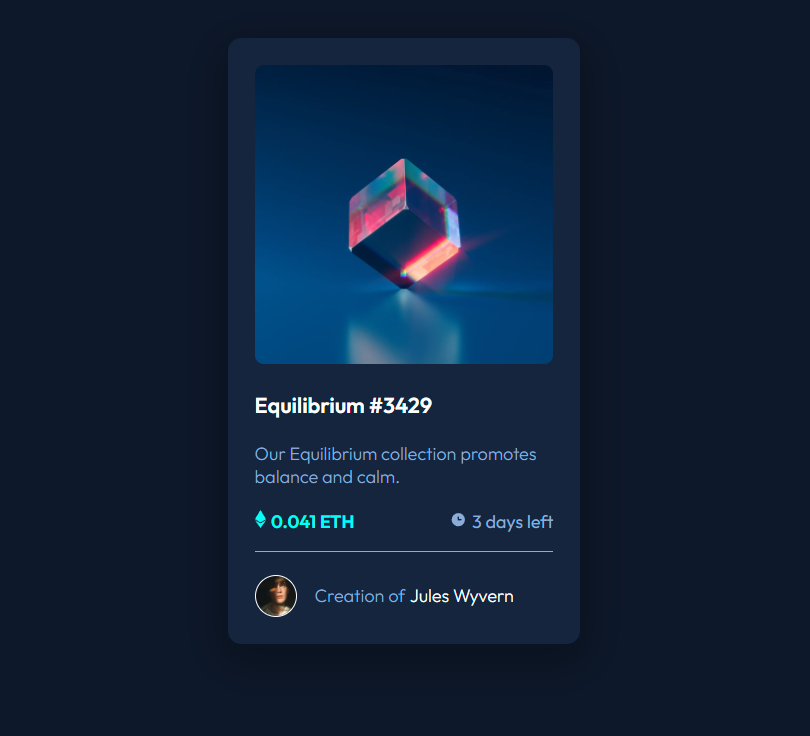

# Frontend Mentor - NFT preview card component solution

This is a solution to the [NFT preview card component challenge on Frontend Mentor](https://www.frontendmentor.io/challenges/nft-preview-card-component-SbdUL_w0U). Frontend Mentor challenges help you improve your coding skills by building realistic projects. 

## Table of contents

- [Overview](#overview)
  - [The challenge](#the-challenge)
  - [Screenshot](#screenshot)
- [My process](#my-process)
  - [Built with](#built-with)
- [Author](#author)

**Note: Delete this note and update the table of contents based on what sections you keep.**

## Overview
An NFT preview card with hover states and concisely laid out text, images, and icons.

### The challenge

Users should be able to:

- View the optimal layout depending on their device's screen size
- See hover states for interactive elements

### Screenshot

### Links

- Solution URL: [https://www.frontendmentor.io/solutions/nft-preview-card-csshtmlflexbox-xR4l_i-r7](https://www.frontendmentor.io/solutions/nft-preview-card-csshtmlflexbox-xR4l_i-r7)
- Live Site URL: [https://mv805.github.io/nft-preview-card-component-main/](https://mv805.github.io/nft-preview-card-component-main/)

## My process

This was a fun layout where I was able to experiment with image manipulation and icon references, along with flexbox layout and thinking through eye pleasing hover states. 

### Built with

- HTML5
- CSS
- Flexbox

## Author

- Website - [mv805](https://mv805.github.io/)
- Frontend Mentor - [@mv805](https://www.frontendmentor.io/profile/mv805)